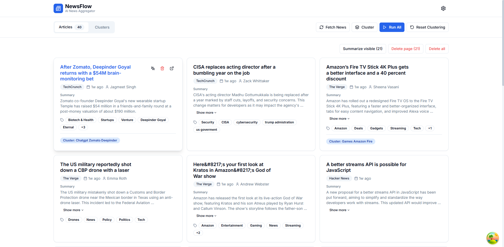
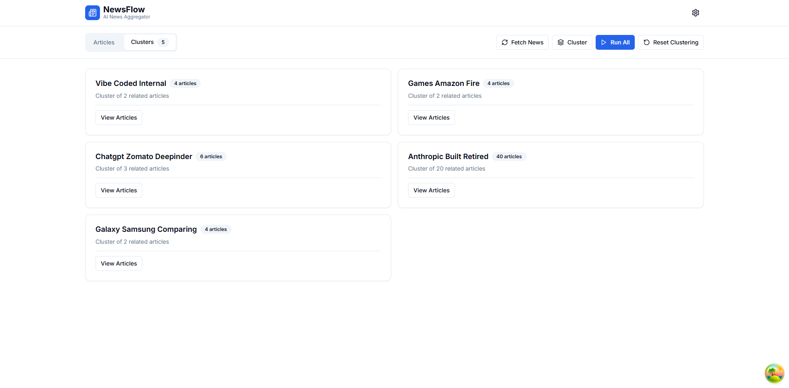
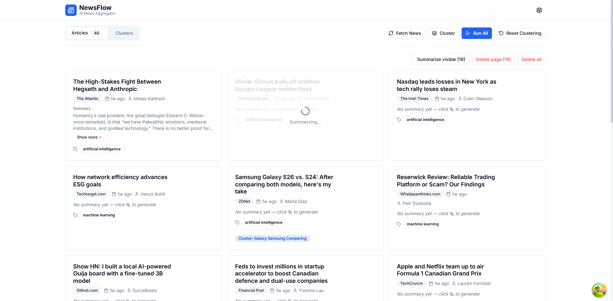
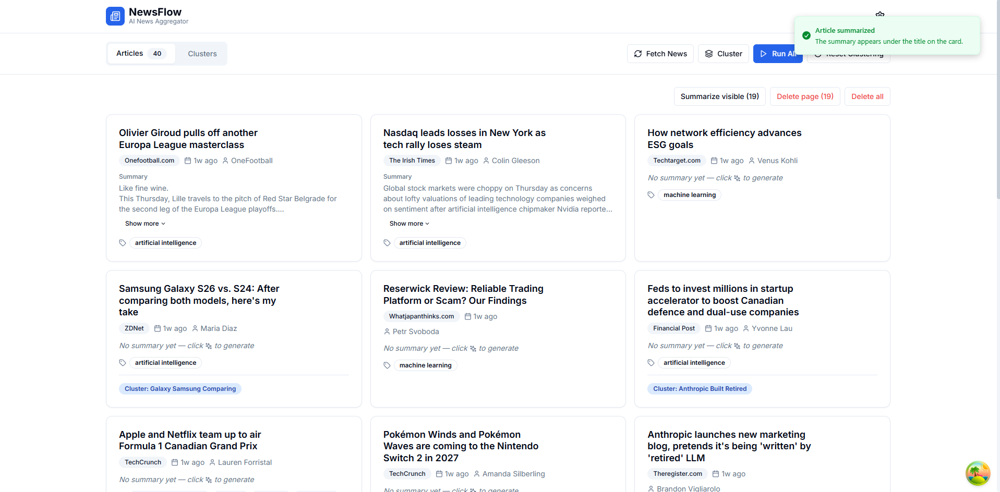

<div align="center">


<br/>

**An intelligent IT/AI news aggregation platform that automatically collects, clusters, and summarizes news using free AI models.**

<br/>

[](https://python.org)
[](https://fastapi.tiangolo.com)
[](https://nextjs.org)
[](https://typescriptlang.org)
[](https://supabase.com)
[](https://tailwindcss.com)

[](https://opensource.org/licenses/MIT)
[](https://github.com/yourusername/newsflow/pulls)
[](/)

</div>

---

## 📸 Live Screenshots

<div align="center">

### 🗞️ Articles View — Real-time AI-powered news feed



> 40+ articles auto-fetched from TechCrunch, The Verge, Hacker News & more — each with AI-generated summaries, cluster tags, and smart keyword labels.

---

### 🧠 Cluster View — Semantic topic grouping



> Articles are automatically grouped into semantic clusters using **HDBSCAN + Vector Embeddings**. No manual configuration needed — the AI finds patterns on its own.

---

### ⚡ AI Summarizing — Real-time LLM streaming



> Watch articles get summarized in real-time by Groq's **Llama 3.1** model. The spinner shows active generation with streaming output.

---

### ✅ Summarization Complete — Developer-focused insights



> Summaries appear instantly on the card after generation, with a green toast notification confirming success. Each summary is stored in Supabase for instant retrieval.

</div>

---

## 🎯 What This Project Demonstrates

> This project is a **full-stack, production-grade AI platform** built entirely from scratch — showcasing end-to-end engineering skills from data ingestion to UI delivery.

<table>
<tr>
<td width="50%">

### 🔬 Backend Engineering
- ✅ Async Python (FastAPI + Uvicorn)
- ✅ Multi-source news crawling pipeline
- ✅ Vector embedding generation (384-dim)
- ✅ HDBSCAN clustering algorithm
- ✅ LLM integration (Groq Llama 3.1)
- ✅ PostgreSQL + pgvector hybrid DB
- ✅ Row-Level Security (RLS) policies
- ✅ Structured logging with structlog

</td>
<td width="50%">

### 🎨 Frontend Engineering
- ✅ Next.js 14 App Router + TypeScript
- ✅ React Query for smart caching
- ✅ Responsive 3-column card layout
- ✅ Real-time optimistic UI updates
- ✅ Infinite scroll + pagination
- ✅ Tailwind CSS + shadcn/ui components
- ✅ Toast notifications + loading states
- ✅ Admin panel with live statistics

</td>
</tr>
</table>

---

## 🏗️ System Architecture

```
╔═══════════════════════════════════════════════════════════════════════════════╗
║                          NewsFlow — Full Stack Pipeline                        ║
╠═══════════════════════════════════════════════════════════════════════════════╣
║                                                                               ║
║   📡 DATA SOURCES                                                             ║
║   ┌───────────────┐  ┌────────────────────┐  ┌──────────────┐                ║
║   │  NewsAPI.org  │  │ RSS Feeds (10+ src)│  │ Web Crawlers │                ║
║   │  (100 req/d)  │  │ TechCrunch, Verge  │  │BeautifulSoup4│                ║
║   └──────┬────────┘  └─────────┬──────────┘  └──────┬───────┘                ║
║          └──────────────────────┼──────────────────── ┘                       ║
║                                 ▼                                             ║
║   🔄 DATA INGESTION LAYER (Python / FastAPI Background Tasks)                ║
║   ┌───────────┐  ┌───────────┐  ┌───────────────────┐  ┌──────────────────┐  ║
║   │  Crawler  │→ │  Dedup    │→ │ Sentence-          │→ │ HDBSCAN Cluster  │  ║
║   │  Engine   │  │  Engine   │  │ Transformers        │  │ (cosine sim)     │  ║
║   └───────────┘  └───────────┘  │ all-MiniLM-L6-v2   │  └──────────────────┘  ║
║                                 └───────────────────┘                        ║
║                                 ▼                                             ║
║   🤖 AI PROCESSING LAYER                                                      ║
║   ┌──────────────────────┐  ┌──────────────────────┐  ┌────────────────────┐  ║
║   │   Groq API (FREE)    │→ │  Summarizer Engine   │→ │  Developer-format  │  ║
║   │  Llama 3.1-8b-instant│  │  (prompt engineering)│  │  key_points/impact │  ║
║   └──────────────────────┘  └──────────────────────┘  └────────────────────┘  ║
║                                 ▼                                             ║
║   🗄️ STORAGE LAYER (Supabase — PostgreSQL + pgvector)                        ║
║   ┌───────────┐  ┌───────────┐  ┌───────────┐  ┌────────────────────────────┐ ║
║   │ articles  │  │ clusters  │  │ summaries │  │ vectors (IVFFlat index)    │ ║
║   │ (raw news)│  │ (grouped) │  │ (AI gen.) │  │ pgvector similarity search │ ║
║   └───────────┘  └───────────┘  └───────────┘  └────────────────────────────┘ ║
║                                 ▼                                             ║
║   🌐 API LAYER (FastAPI — Auto OpenAPI Docs)                                  ║
║   ┌──────────┐  ┌────────────┐  ┌─────────────┐  ┌───────────┐              ║
║   │  /news   │  │ /clusters  │  │  /summarize │  │  /health  │              ║
║   │ GET/POST │  │  GET/DEL   │  │    POST     │  │   GET     │              ║
║   └──────────┘  └────────────┘  └─────────────┘  └───────────┘              ║
║                                 ▼                                             ║
║   💻 FRONTEND LAYER (Next.js 14 + TypeScript + React Query)                  ║
║   ┌──────────┐  ┌──────────┐  ┌────────────┐  ┌────────────┐               ║
║   │ Articles │  │ Clusters │  │  Summary   │  │   Admin    │               ║
║   │   View   │  │   View   │  │   Cards    │  │   Panel    │               ║
║   └──────────┘  └──────────┘  └────────────┘  └────────────┘               ║
║                                                                               ║
╚═══════════════════════════════════════════════════════════════════════════════╝
```

---

## 🛠️ Tech Stack

<div align="center">

| Layer | Technology | Why I Chose It |
|:-----:|:----------:|:--------------:|
| 🖼️ Frontend | **Next.js 14** + TypeScript | App Router, RSC, type safety |
| 🎨 UI | **Tailwind CSS** + shadcn/ui | Utility-first, consistent design tokens |
| ⚡ State | **React Query** (TanStack) | Intelligent caching, background refetch |
| 🐍 Backend | **FastAPI** + Uvicorn | Async Python, auto OpenAPI, fast iteration |
| 🗄️ Database | **Supabase** (PostgreSQL) | Free tier, RLS, realtime, pgvector ext |
| 🔍 Vectors | **pgvector** + IVFFlat | Hybrid relational + vector search |
| 🕷️ Crawling | **BeautifulSoup4** + feedparser | Lightweight, flexible HTML + RSS parsing |
| 🧠 Embeddings | **sentence-transformers** | Local, free, 384-dim semantic vectors |
| 🤖 AI/LLM | **Groq API** (Llama 3.1) | Free tier, fast inference, no credit card |
| 📊 Clustering | **HDBSCAN** + scikit-learn | No preset K required, handles noise |

</div>

---

## ⚙️ Core Engineering Highlights

### 🔵 Intelligent Clustering — Zero Config Required
The platform uses **HDBSCAN** (Hierarchical Density-Based Spatial Clustering) combined with **cosine similarity** on 384-dimensional sentence vectors. Unlike K-Means, HDBSCAN automatically discovers the number of clusters and handles noise points — making it ideal for dynamic news datasets.

```python
# backend/app/services/clustering.py
# HDBSCAN with cosine similarity — auto-discovers cluster count
clusterer = hdbscan.HDBSCAN(
    min_cluster_size=2,
    metric='euclidean',           # Applied on normalized vectors → cosine
    cluster_selection_epsilon=0.15
)
```

### 🟣 Developer-Focused AI Summaries
Prompt engineering is used to ensure LLM output is structured and actionable for developers:

```python
# backend/app/services/summarizer.py
SYSTEM_PROMPT = """You are a senior developer summarizing tech news.
Output JSON with: summary, key_points[], developer_impact, use_cases[].
Focus on: API changes, new frameworks, performance improvements, security."""
```

### 🟢 Performance — Parallel DB Operations
The article list endpoint runs **two DB queries in parallel** (count + data) using a thread pool, minimizing UI latency:

```python
# backend/app/routers/news.py
count_future = executor.submit(get_count, filters)
data_future  = executor.submit(get_articles, filters, page, size)
total = count_future.result()
articles = data_future.result()
```

### 🔴 Frontend Smart Caching
React Query is configured with aggressive caching to prevent unnecessary refetches:

```typescript
// frontend/src/lib/api.ts
queryClient.setDefaultOptions({
  queries: {
    staleTime: 5 * 1000,      // Data fresh for 5s
    cacheTime: 5 * 60 * 1000, // Keep cache for 5 min
    refetchOnWindowFocus: false,
  }
});
```

---

## 🚀 Quick Start

### Prerequisites

| Requirement | Version | Notes |
|------------|---------|-------|
| Python | 3.10+ | With pip |
| Node.js | 18+ | With npm |
| Supabase account | — | Free tier, no card needed |
| Groq API key | — | Free tier at [console.groq.com](https://console.groq.com) |

### 1️⃣ Clone & Setup

```bash
git clone https://github.com/yourusername/newsflow.git
cd newsflow
```

### 2️⃣ Backend

```bash
cd backend
python -m venv venv
# Windows:
venv\Scripts\activate
# macOS/Linux:
source venv/bin/activate

pip install -r requirements.txt
cp .env.example .env
# → Fill in your API keys in .env
```

> **Windows note:** If `pip install` fails for `sentence-transformers`, install [Build Tools for Visual Studio](https://visualstudio.microsoft.com/downloads/) and select "Desktop development with C++".

### 3️⃣ Frontend

```bash
cd frontend
npm install
cp .env.example .env.local
# → Set NEXT_PUBLIC_API_URL=http://localhost:8000
```

### 4️⃣ Database (Supabase)

1. Create a new Supabase project at [supabase.com](https://supabase.com)
2. Open **SQL Editor** and run the full schema in [`docs/database.sql`](docs/database.sql)
3. Paste your project URL + keys in `.env`

### 5️⃣ Run It

```bash
# Terminal 1 — Backend API
cd backend && uvicorn app.main:app --reload --port 8000

# Terminal 2 — Frontend
cd frontend && npm run dev
```

| Service | URL |
|---------|-----|
| 🌐 Frontend | http://localhost:3000 |
| 📘 API Docs | http://localhost:8000/docs |
| 💓 Health | http://localhost:8000/health |

---

## 🔧 Environment Variables

### Backend — `backend/.env`

```env
# Supabase (get from your project settings)
SUPABASE_URL=https://xxxx.supabase.co
SUPABASE_KEY=your-anon-key
SUPABASE_SERVICE_KEY=your-service-role-key

# Groq — Free LLM API  →  https://console.groq.com
GROQ_API_KEY=gsk_xxxxxxxxxxxxxxxxxxxx
GROQ_MODEL=llama-3.1-8b-instant

# NewsAPI — Free API  →  https://newsapi.org
NEWSAPI_KEY=your-newsapi-key

# App Configuration
APP_ENV=development
LOG_LEVEL=INFO
CLUSTER_SIMILARITY_THRESHOLD=0.85
```

### Frontend — `frontend/.env.local`

```env
NEXT_PUBLIC_API_URL=http://localhost:8000
```

---

## ⚡ Performance Metrics

| Operation | Optimization Applied | Result |
|-----------|---------------------|--------|
| Article List | Parallel count + data queries | ~2× faster |
| Clustering | Batch vector update per cluster | O(n) not O(n²) |
| Embeddings | Local model, no API call | Zero latency cost |
| Frontend | React Query 5s staleTime | Near-zero redundant requests |
| Delete All | Hard-delete + immediate cache invalidation | Instant UI sync |

---

## 💰 Total Cost — $0/month

| Service | Free Limit | Estimated Usage |
|---------|-----------|----------------|
| **Supabase** | 500MB DB + 2GB egress | Well within free tier |
| **Groq API** | 14,400 requests/day | <100 req/day typical |
| **NewsAPI** | 100 requests/day | ~10 req/day |
| **Vercel** (optional) | Generous free tier | $0 |
| **Railway** (optional) | $5 credit/month | $0 |
| **Total** | — | **$0 / month** 🎉 |

---

## 📁 Project Structure

```
newsflow/
├── 📄 README.md
├── 📄 PROJECT_SUMMARY.md
│
├── 🐍 backend/
│   ├── app/
│   │   ├── main.py              # FastAPI entry point + CORS
│   │   ├── config.py            # Pydantic settings from env
│   │   ├── database.py          # Supabase client singleton
│   │   ├── models.py            # Pydantic request/response models
│   │   ├── services/
│   │   │   ├── crawler.py       # Multi-source news crawler
│   │   │   ├── embedding.py     # sentence-transformers wrapper
│   │   │   ├── clustering.py    # HDBSCAN + cosine clustering
│   │   │   └── summarizer.py    # Groq LLM + prompt engineering
│   │   └── routers/
│   │       ├── news.py          # /api/v1/news endpoints
│   │       ├── clusters.py      # /api/v1/clusters endpoints
│   │       └── admin.py         # /api/v1/admin endpoints
│   ├── requirements.txt
│   └── .env.example
│
├── ⚛️  frontend/
│   ├── src/
│   │   ├── app/                 # Next.js App Router pages
│   │   ├── components/
│   │   │   ├── ui/              # shadcn-style base components
│   │   │   ├── NewsCard.tsx     # Article card with summary
│   │   │   ├── ClusterCard.tsx  # Cluster group card
│   │   │   ├── ActionBar.tsx    # Fetch/Cluster/Run All buttons
│   │   │   ├── AdminPanel.tsx   # Stats dashboard
│   │   │   └── Header.tsx
│   │   ├── hooks/
│   │   │   └── useNews.ts       # React Query hooks
│   │   ├── lib/
│   │   │   ├── api.ts           # Axios API client
│   │   │   └── providers.tsx    # QueryClient provider
│   │   └── types/index.ts       # TypeScript interfaces
│   ├── package.json
│   └── .env.example
│
├── 📚 docs/
│   ├── ARCHITECTURE.md          # Deep-dive architecture docs
│   ├── API.md                   # Full API reference
│   ├── SETUP.md                 # Detailed setup guide
│   ├── CLUSTERING_GUIDE.md      # Clustering deep-dive
│   └── database.sql             # Full Supabase schema + RLS
│
├── 🖼️  image/
│   ├── article.png
│   ├── cluster.png
│   ├── summarizing.png
│   └── summarize_success.png
│
└── 🔧 scripts/
    └── perf-test.mjs            # API response time benchmark
```

---

## 📚 Documentation

| Document | Description |
|----------|-------------|
| [📐 Architecture](docs/ARCHITECTURE.md) | System design, data flow, component interactions |
| [📘 API Reference](docs/API.md) | All endpoints, request/response schemas |
| [🔧 Setup Guide](docs/SETUP.md) | Step-by-step setup + troubleshooting |
| [🧠 Clustering Guide](docs/CLUSTERING_GUIDE.md) | HDBSCAN deep-dive, tuning tips |
| [🗄️ Database Schema](docs/database.sql) | Full SQL with pgvector, RLS, triggers |

---

## 🔮 Future Roadmap

- [ ] 🔐 User authentication with Supabase Auth
- [ ] 📅 Automated cron-based news scheduling
- [ ] 📧 Email digest subscriptions
- [ ] 🔔 Slack / Discord webhook integration
- [ ] 🌐 Multi-language support
- [ ] 📊 Sentiment analysis layer
- [ ] 📈 Trend detection & topic timeline
- [ ] 🔗 GitHub repository auto-linking
- [ ] 🚀 Redis caching for production scale

---

## 🤝 Contributing

Contributions, issues, and feature requests are welcome!
Feel free to check the [issues page](https://github.com/yourusername/newsflow/issues).

```bash
# Fork → Clone → Branch → Commit → Push → PR
git checkout -b feature/amazing-feature
git commit -m "feat: add amazing feature"
git push origin feature/amazing-feature
```

---

## 📄 License

This project is licensed under the **MIT License** — see the [LICENSE](LICENSE) file for details.

---

<div align="center">

**Built with 🤖 AI + ☕ Coffee + 💪 Determination**

*If this project helped you, please consider giving it a ⭐*

</div>
